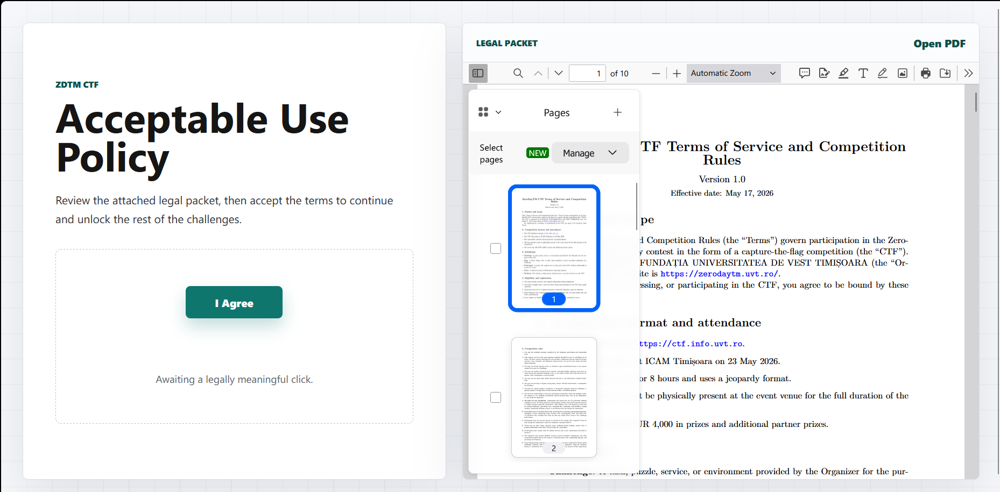
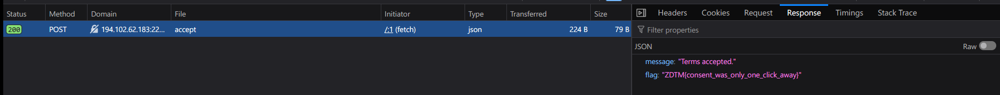

# Consent-Kiosk

## Description:

Please read and accept our terms.
Btw, HR designed the button to be very respectful of personal space.

## Solve:

The website displays a PDF viewer:



Looking at the source, we see 2 important things:

One `telemetry.js`

```html
<script defer src="/telemetry.js"></script>
```

And 

`button.dataset.nonce`

```html
<div class="action-zone">
          <button id="accept" tabindex="-1" data-nonce="ahcFWYPmeT2_NgKI8YurxtYD">
            I Agree
          </button>
          <p id="status" aria-live="polite">Awaiting a legally meaningful click.</p>
 </div>
```

Inside telemetry.js:

```js
(() => {
  const button = document.getElementById("accept");
  const status = document.getElementById("status");

  async function submitConsent() {
    status.textContent = "Submitting consent packet...";
    const response = await fetch("/api/accept", {
      method: "POST",
      headers: { "Content-Type": "application/json" },
      body: JSON.stringify({
        consent: true,
        nonce: button.dataset.nonce,
        timestamp: Date.now()
      })
    });
    const data = await response.json();
    document.body.innerHTML = `<main class="accepted"><h1>${data.message}</h1><code>${data.flag || ""}</code></main>`;
  }

  button.addEventListener("click", submitConsent);
})();
```

So that means we need to make a simple fetch request to the endpoint with that nonce from the button that we saw to get the flag!

```js
fetch("/api/accept", {
      method: "POST",
      headers: { "Content-Type": "application/json" },
      body: JSON.stringify({
        consent: true,
        nonce: "ahcFWYPmeT2_NgKI8YurxtYD",
        timestamp: Date.now()
      })
    });
```

Response:




### Flag: 
ZDTM{consent_was_only_one_click_away}