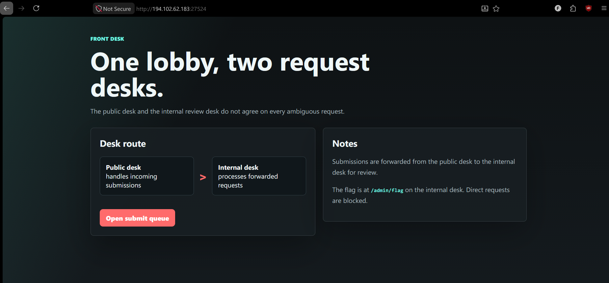
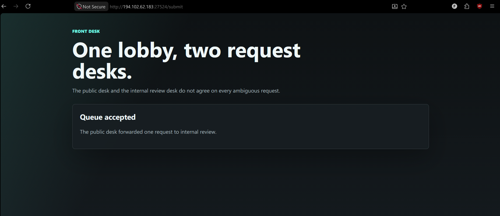
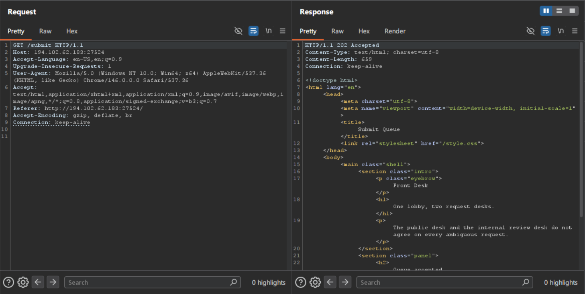
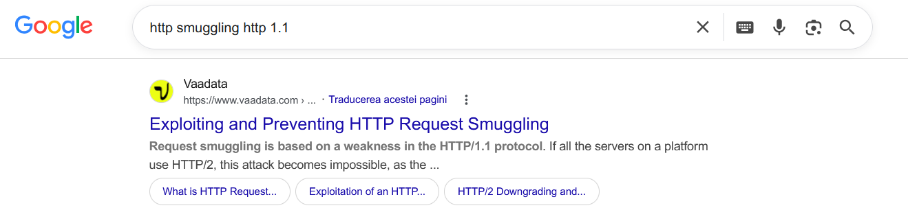
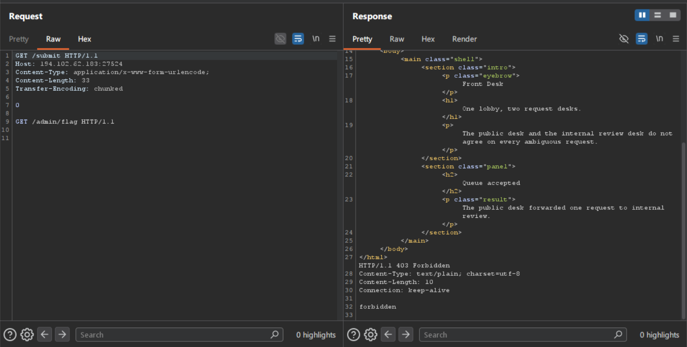
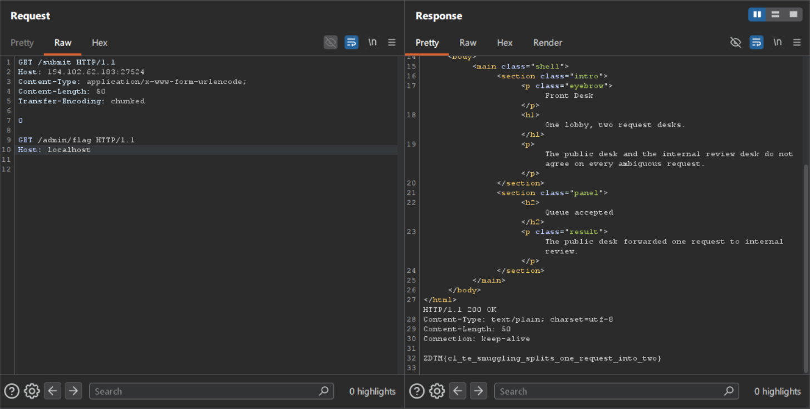

# Front Desk

## Description

the public desk counts bytes
Get to the restricted localhost endpoint, /admin/flag !

## Solve

Its a website that does `internal` requests through the `public desk` and we know the flag is at `/admin/flag` which is at localhost.

`/submit`

Lets look in `Burp Suite` at how the requests are handled!

2 Things are important here:

1. the 202 accepted
2. HTTP/1.1

So we can be talking about a HTTP Request Smuggling.
A quick google search about it:

On the website it talk about how to identifity and check if the vulnerability is present.
You can figure this out by trying several techniques like:

1. Content-Type: application/x-www-form-urlencode;
2. Content-Length & Transfer-Encoding

It does a request for us to `/admin/flag`, the first request howerer can also be `/` or `/submit` it does not matter.

But we get `Forbidden`, lets try to add the `Host: localhost` header!

And we have done an internal request to reach `/admin/flag`

### Flag:
ZDTM{cl_te_smuggling_splits_one_request_into_two}