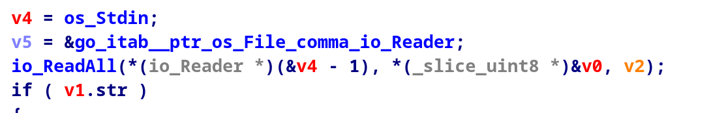
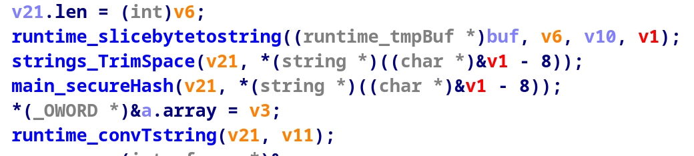
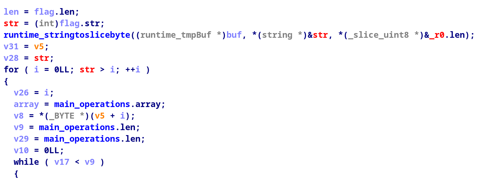
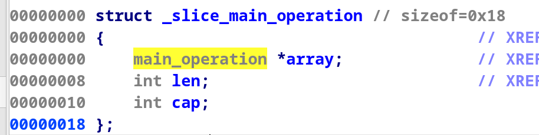
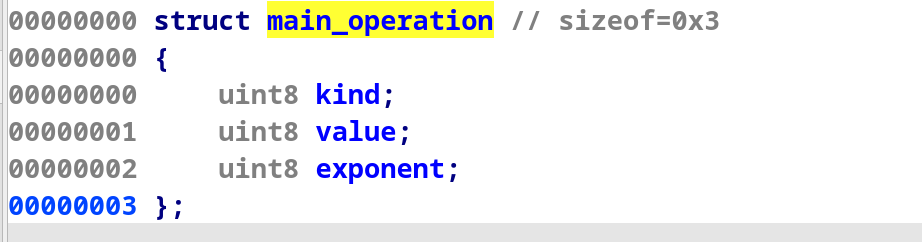
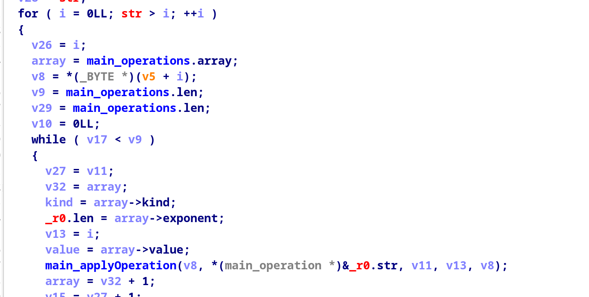

# Go-Away
**Author:** 0v3rCl0kEd  
**Category:** Reverse Engineering   
**Points:** 500  
**Solves:** 4          
**Flag:** `ZDTM{go_run_main.go_shenanigans}`

---

## Description
> I've made this sure cool secure hashing app.
> Check out my indestructible hash:
> `05aa11f138bdc0f3ff2b3ff37ac390f6c3f17cf74012ccce82c0627fe86cc76cd`

We can recieve the hashed output of the flag using the given binary

---

## Files

- `go-away` — 2.4 MB, ELF 64-bit Executable 


---

## Analysis

Opening the binary in ida, we can see its written in GO.

Inspecting the **`main_main`** function we can see how the binary works


<<<<<<< HEAD

The binary reads from stdin given input and saves it. It also expects and EOF , especially from the output of a `cat` program
=======
The binary reads from stdin given input and saves it. It also expects and EOF , especially from the output of a `cat` command
>>>>>>> 6f244b81fc73e3b73361155687780405a0c8d1c2



We can see the program processes the string and then passes it to the **`main_secureHash`** function



Inside the **`main_secureHash`** function, we can see it loops over the lenght of the `flag` argument, which is the contents of the stdin, aka our flag plaintext.

Looking at the code, we can see the `main_operations` local variable, which is defined in the data segment as a `_slice _main_operation` custom data type. Lets look into it:


It contains an array of another custom structure, `main_operation`, and two int variables, len and cap.

The other structure is defined like this:


It seems to have some kind of value, kind, and exponent.

Now that we know what the `main_operations` variable is, lets look again in the `main_secureHash` function:


This means that for every character of the plain text, it takes its index, and using that works with the operations table at that same index, meaning it hashes every character differently based on its index.

At this point i time i gave up reverse engineering it because it was too complex.

## The breaktrough

Because it hashes each byte of the plaintext independently based on its index, i realized we can brute force the flag when i tried hashing the flag prefix: 
`ZDTM{` and i got: `05aa11f138`
### This is the beggining of our given hash!

Making a simple bruteforcer using the pwn module:

```py
import string
from pwn import *
alphanum = string.printable
hashflag = '05aa11f138bdc0f3ff2b3ff37ac390f6c3f17cf74012ccce82c0627fe86c76cd'
flag = "ZDTM{"
context.log_level='WARN'
for i in range(len(bytes.fromhex(hashflag))):
    for char in alphanum:
        with open('flag', 'w+') as file:
            file.write(flag+char)
        p = process('./go-away')
        p.send(flag+char)
        p.shutdown()
        value = p.recvline().strip().decode()
        print(value)
        p.close()
        # exit()
        if hashflag.startswith(value):
            flag+=char
            break

print(flag)
```
## Getting the Flag

Running the program gave us:
```bash
python main.py

05aa11f13822
05aa11f1383b
05aa11f13838
[...truncated output...]
05aa11f138bdc0f3ff2b3ff37ac390f6c3f17cf74012ccce82c0627fe86c76cd8bf6ddd40f
05aa11f138bdc0f3ff2b3ff37ac390f6c3f17cf74012ccce82c0627fe86c76cd
ZDTM{go_run_main.go_shenanigans}   
```

**flag**: `ZDTM{go_run_main.go_shenanigans}`
