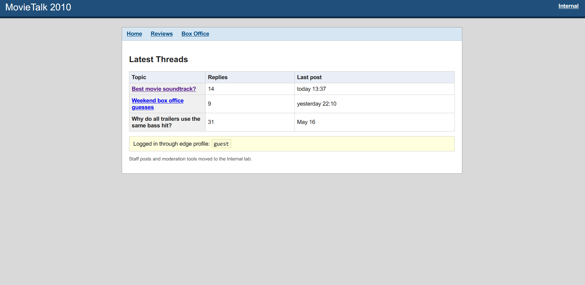
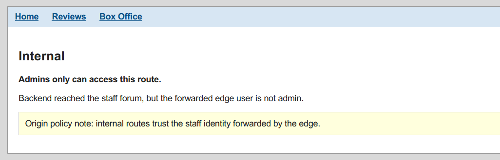
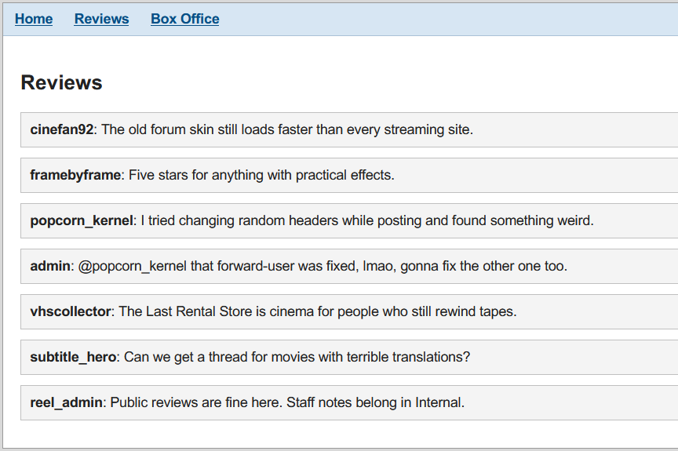
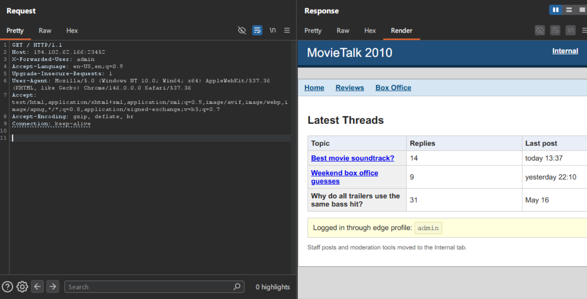
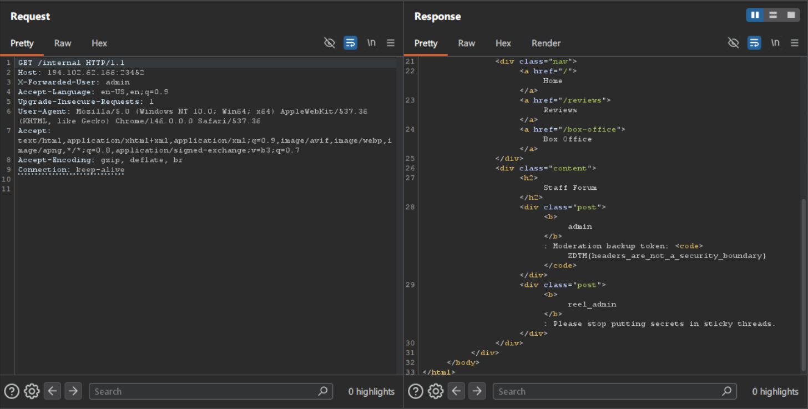

# Movie-Proxy

## Description

MovieTalk 2010 is a tiny public forum for proxying movie reviews and box office guesses.

## Solve

The page looks like a forum.

It has 3 main pages and a `internal` page!

Opening the `/internal`:

So we need to be authentificated in order to get to the `/internal` page.

In the `/reviews`

The admin talks about some `forward-user`, that looks like a supposed `request header`.

Lets try `X-Forwarded-User`!

Request:

We got `admin`!

Another requests to `/internal` gives us the flag!

### Flag: 
ZDTM{headers_are_not_a_security_boundary}