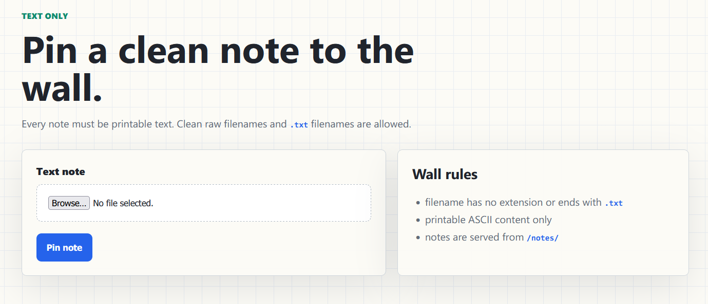
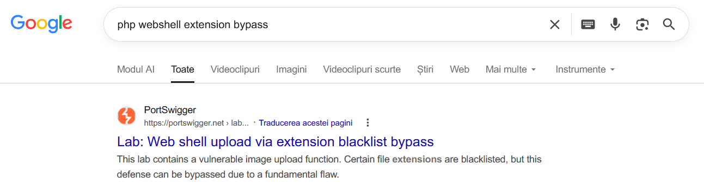
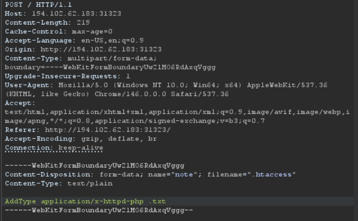
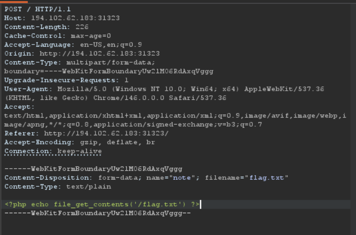
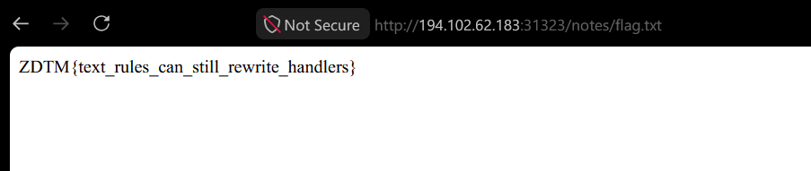

# Open-Gallery-text-only

## Description

the note wall accepts printable raw notes with no extension, or printable .txt files
get flag from /flag.txt

## Solve

This one is a `reworked` challenge `Open-Gallery`, but this one we are only allowed to upload `.txt` files
 


So that means, that we can still upload that `.php` file that is going to read the `/flag.txt`, but with the `.txt` extenstion and somehow make the website render the `php` code.

Doing a google search with: `php webshell entension bypass`

We will see a `PortSwigger` link!



On that page we can see that its a similar challenge, where they upload a specific payload like:

```js
AddType application/x-httpd-php .l33t
```

Into `.htaccess`, so that when a file with the extension `.l33t` is opened on the website, if the file has `php` code, it will be rendered!

Sounds like our challenge!

We just do the same thing but with the `.txt` extension!

We can use `Burp Suite`, to make this go faster!

First request:



Second request:



And final requests to get the flag:



### Flag:
ZDTM{text_rules_can_still_rewrite_handlers} 