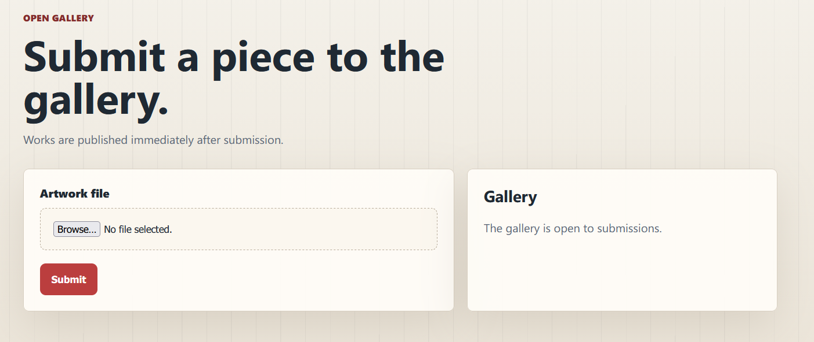
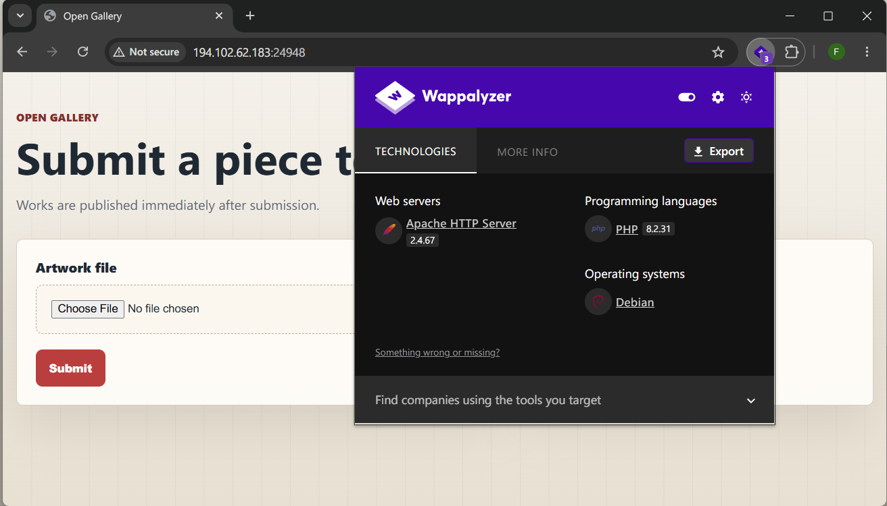
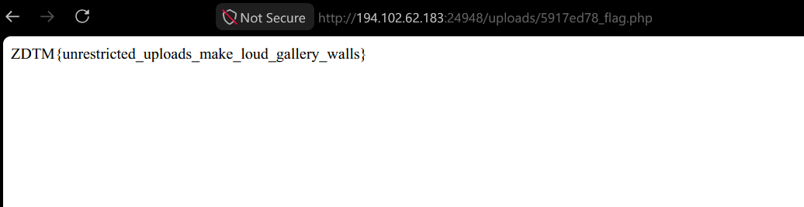

# Open-Gallery

## Description

the gallery accepts anything the artist brings.
Get the flag from /flag.txt

## Solve

On the website we are allowed to upload `artworks`, which can be a security risk if the filtering is not done right!



Looking through `wappalyzer` to figure out the used libraries, we can figure out its `php`!



So that means is, we need to upload a bad .php file that is going to read the file contents of `/flag.txt`!

A simple php payload looks like this:

```php
<?php echo file_get_contents('/flag.txt') ?>
```

Uploading the file to the website and pressing on the button `View Submission`, redirects us to the flag!



### Flag:
ZDTM{unrestricted_uploads_make_loud_gallery_walls}