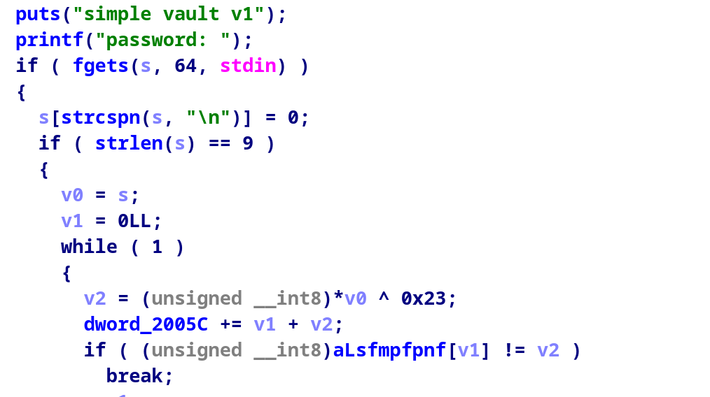

# Simple-Vault
**Author:** exuletz   
**Category:** Reverse Engineering   
**Points:** 500  
**Solves:** 4          
**Flag:** `{s1mPl3_vAuLt_r3v3rS1nG}`

---

## Description
> easy lol

---

## Files

- `simple-vault` — 66.2 KB, ELF ARM 64-bit Executable 


---

## Analysis

Opening the binary in ida we can see its inner workings:


As we can see inside the main function, it asks for a password, and checks if every byte of our input is equal with every byte of the `aLsfmpfpnf` array xored with 0x23


After that it goes to use our input to decrypt the flag. 
If we reverse the password, we can get the program to decrypt the flag for us


## Getting the password

Its a simple xor in python

```py
string = b'LSFMPFPNF'
byte = bytearray()
for i in range(9):
    byte.append(string[i]^0x23)

print(byte)

```
The output is `opensesme`

## Getting the Flag

Running the program with the correct password:
```bash
┌──(parallels㉿kali-linux-2025-2)-[~/Desktop]
└─$ ./simple_vault
simple vault v1
password: opensesme
flag: ZDTM{s1mPl3_vAuLt_r3v3rS1nG}
```

**flag**: `{s1mPl3_vAuLt_r3v3rS1nG}`