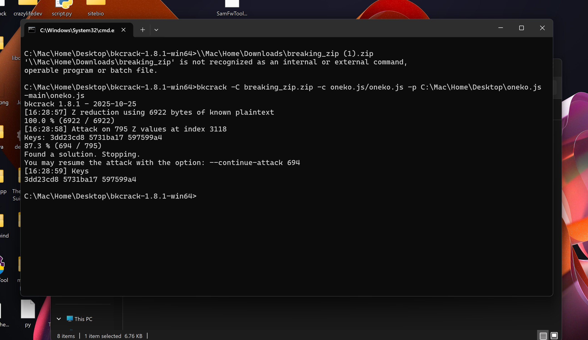

# breaking-zip — CTF Writeup

**Author:** AndreiCat  
**Category:** Misc / Forensics  
**Points:** 90  
**Solves:** 14  
**Flag:** `ZDTM{ZipCrypto_security_is_a_lie_6c6f6c}`

---

## Description

> This zip archive is impossible to unzip, therefore it's impossible to get the flag.  
> Source? Just trust me bro.

The description is a bluff — the ZIP uses **ZipCrypto** encryption, which is vulnerable to a known-plaintext attack.

---

## Analysis

We're given `breaking_zip.zip` (26.5 KB). Listing its contents reveals:

```
oneko.js/oneko.js
oneko.js/oneko-ie6.js
oneko.js/README.md
oneko.js/oneko-webring.js
oneko.js/demo.html
oneko.js/flag.txt
oneko.js/LICENSE
oneko.js/oneko.gif
```

All files are encrypted with ZipCrypto (`flag_bits & 0x1 = 1`). The archive contains **oneko.js** — a well-known open source project publicly available on GitHub at `adryd325/oneko.js`.

This is the key insight: since we know the exact contents of `oneko.js/oneko.js` from the public repo, we can perform a **known-plaintext attack** to recover the internal ZipCrypto keys, without ever needing the password.

---

## Tool: bkcrack

[bkcrack](https://github.com/kimci86/bkcrack) implements the Biham & Kocher known-plaintext attack against ZipCrypto. It requires at least 12 bytes of known plaintext (we have 6929 bytes — more than enough).

### Step 1 — Get the known plaintext

Download `oneko.js` from the public GitHub repository:

```
https://raw.githubusercontent.com/adryd325/oneko.js/main/oneko.js
```

### Step 2 — Recover the keys

```cmd
bkcrack -C breaking_zip.zip -c oneko.js/oneko.js -p oneko.js
```



bkcrack used 6922 bytes of plaintext, attacked 795 Z values, and found a solution in under 2 seconds:

```
Keys: 3dd23cd8 5731ba17 597599a4
```

### Step 3 — Decrypt the flag

Using the recovered keys, decrypt `flag.txt` directly without needing the password:

```cmd
bkcrack -C breaking_zip.zip -k 3dd23cd8 5731ba17 597599a4 -c oneko.js/flag.txt -d flag.txt
type flag.txt
```

Output:
```
ZDTM{ZipCrypto_security_is_a_lie_6c6f6c}
```

---

## Why does this work?

ZipCrypto (the default encryption in classic ZIP files) is based on a stream cipher with a weak key schedule. If an attacker knows at least 12 bytes of any encrypted file in the archive, they can recover the 96-bit internal key state using the Biham & Kocher attack. Once the keys are known, **all files in the archive can be decrypted** — including `flag.txt`.

The moral: never use ZipCrypto for sensitive data. Use AES-256 encryption (available in modern ZIP tools with the `-e` flag) instead.

---

## Steps Summary

1. List the ZIP contents — notice it contains the public `oneko.js` repo
2. Download the known plaintext: `oneko.js` from GitHub
3. Run `bkcrack` to recover the internal keys using the known plaintext
4. Use the recovered keys to decrypt `flag.txt`

**Flag:** `ZDTM{ZipCrypto_security_is_a_lie_6c6f6c}`
