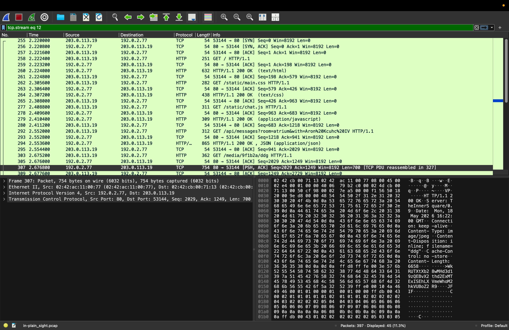
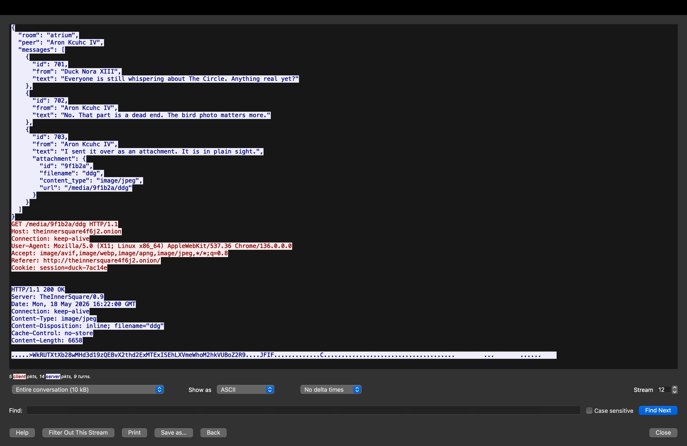

# in-plain-sight — CTF Writeup

**Author:** Elure  
**Category:** Network Forensics  
**Points:** 50  
**Solves:** 18  
**Flag:** `ZDTM{Woo00www_s@@o_kawa1111!!!-ufyhh3hdU@hgd}`

---

## Description

> dw about it DW is full of mysteries [=

The hint "DW" refers to the **Dark Web** — as we'll discover, the traffic in the PCAP is directed at a `.onion` address.

---

## Analysis

We're given a single file: `in-plain_sight.pcap` (112.8 KB).

Opening it in **Wireshark**, we can see a large amount of HTTP traffic between `203.0.113.19` and `192.0.2.77`. The destination host header reveals it's `theinnersquare4f6j2.onion` — a dark web site accessed via Tor.



Browsing through the streams, **stream 12** is the most interesting. It contains a full conversation: a JSON API response from `/api/messages` reveals a chat in a room called `atrium` between two users:

- **Duck Nora XIII:** *"Everyone is still whispering about The Circle. Anything real yet?"*
- **Aron Kcuhc IV:** *"No. That part is a dead end. The bird photo matters more."*
- **Aron Kcuhc IV:** *"I sent it over as an attachment. **It is in plain sight.**"* — with an attached image named `ddg`

The challenge title is a direct quote from the conversation. The browser then fetches the image via `GET /media/9f1b2a/ddg`.



Looking at the server's response, the `Content-Type` is `image/jpeg` and `Content-Length` is 6658. But right before the JPEG magic bytes (`FFD8` / `JFIF`), there's a suspicious ASCII blob embedded in the image data:

```
WkRUTXtXb28wMHd3d19zQEBvX2thd2ExMTExISEhLXVmeWhoM2hkVUBoZ2R9
```

This is a **Base64-encoded string**. Decoding it (note: on macOS, pipe through `echo` rather than passing as an argument):

```bash
echo "WkRUTXtXb28wMHd3d19zQEBvX2thd2ExMTExISEhLXVmeWhoM2hkVUBoZ2R9" | base64 -d
```

Output:
```
ZDTM{Woo00www_s@@o_kawa1111!!!-ufyhh3hdU@hgd}
```

The flag was hidden in plain sight — prepended to a JPEG file and sent over a dark web messaging platform, exactly as the conversation hinted.

---

## Steps Summary

1. Open `in-plain_sight.pcap` in Wireshark
2. Filter by `tcp.stream eq 12` or use **Follow → TCP Stream** to browse streams
3. Read the JSON chat: Aron says *"It is in plain sight"* and attaches image `ddg`
4. The browser fetches `GET /media/9f1b2a/ddg` — inspect the response bytes
5. Spot the Base64 blob prepended before the JPEG `JFIF` header
6. Decode: `echo "<blob>" | base64 -d`

**Flag:** `ZDTM{Woo00www_s@@o_kawa1111!!!-ufyhh3hdU@hgd}`
